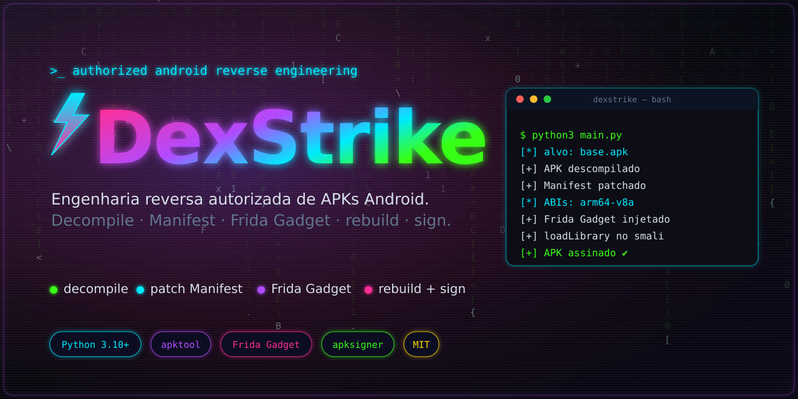
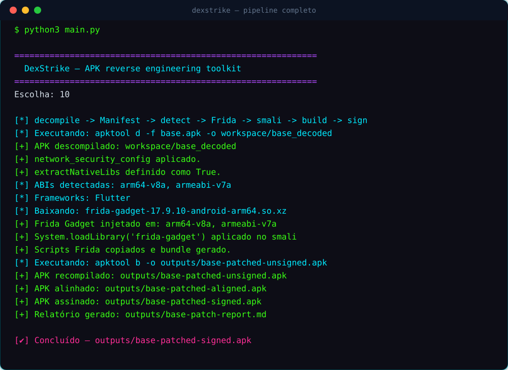
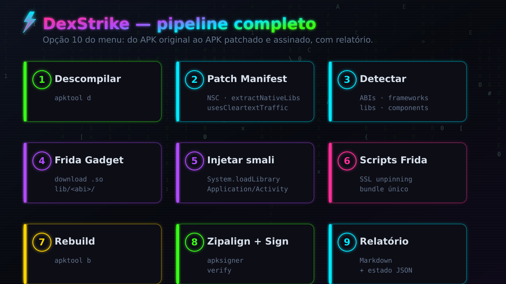

<div align="center">



# DexStrike

**Toolkit em Python que automatiza o fluxo de engenharia reversa autorizada de APKs Android — do decompile ao APK patchado, injetado com Frida e assinado.**


</div>

---

> [!WARNING]
> **Uso autorizado apenas.** Esta ferramenta destina-se a pesquisa de segurança, testes em
> aplicativos próprios, ambientes de laboratório e engagements com autorização explícita.
> Modificar, redistribuir ou analisar aplicativos de terceiros sem permissão pode violar
> leis, termos de uso e direitos autorais. Você é o único responsável pelo uso que faz dela.

## Sumário

- [O que ela faz](#o-que-ela-faz)
- [Demonstração](#demonstração)
- [Pipeline completo](#pipeline-completo)
- [Requisitos](#requisitos)
- [Instalação](#instalação)
- [Como usar](#como-usar)
- [Estrutura do projeto](#estrutura-do-projeto)
- [Keystore e assinatura](#keystore-e-assinatura)
- [Scripts Frida](#scripts-frida)
- [Testes](#testes)
- [Limitações conhecidas](#limitações-conhecidas)
- [Roadmap](#roadmap)
- [Licença](#licença)

## O que ela faz

Um único menu interativo cobre o fluxo de patch que normalmente é feito à mão:

- 🧩 **Descompila** o APK com `apktool`;
- 📝 **Patcha o `AndroidManifest.xml`**: `networkSecurityConfig`, `extractNativeLibs=true`,
  `usesCleartextTraffic` e `debuggable` (opcionais), preservando todos os namespaces XML;
- 🔍 **Detecta** ABIs nativas, frameworks (React Native, Flutter, Unity, Cordova, Xamarin),
  libs de rede/segurança (OkHttp, Retrofit, Cronet, TrustKit, RootBeer) e componentes do Manifest;
- 📦 **Baixa o Frida Gadget** correto para cada ABID e o injeta em `lib/<abi>/`;
- 🧬 **Injeta `System.loadLibrary("frida-gadget")`** no smali da classe `Application` ou da
  Activity de `LAUNCHER`, de forma **idempotente** (não duplica a injeção);
- 🔓 **Copia scripts Frida** de SSL unpinning (baseados no
  [frida-interception-and-unpinning](https://github.com/httptoolkit/frida-interception-and-unpinning));
- 🔨 **Recompila**, faz **zipalign** e **assina** com `apksigner` (ou `jarsigner` como fallback);
- 📄 **Gera um relatório** em Markdown com tudo que foi feito.

Escrita **somente com a biblioteca padrão do Python** — sem dependências de runtime via `pip`.

## Demonstração

<div align="center">



<sub>Exemplo de execução do pipeline completo (opção 10 do menu).</sub>

</div>

## Pipeline completo

<div align="center">



</div>

## Requisitos

O projeto roda só com a stdlib do Python, mas usa ferramentas de sistema:

| Ferramenta | Para quê | Obrigatória |
|---|---|---|
| `apktool` | descompilar e recompilar | ✅ |
| Java JDK (`keytool`, `jarsigner`) | assinatura (fallback) | ✅ |
| `apksigner` + `zipalign` (Android build-tools) | assinatura/alinhamento modernos | recomendada |
| `adb` | instalar o APK no device | opcional |
| `librsvg` (`rsvg-convert`) | regenerar as imagens do README | opcional |

No **Arch Linux**:

```bash
./scripts/install-arch-deps.sh
# ou
sudo pacman -S --needed apktool android-tools jdk-openjdk xz
```

## Instalação

```bash
git clone https://github.com/wesleyruam/DexStrike.git
cd DexStrike
python3 main.py
```

Opcionalmente, como pacote:

```bash
pip install -e .
dexstrike
```

## Como usar

```bash
python3 main.py     # ou ./scripts/run.sh
```

Fluxo mais rápido no menu:

```text
 1) Configurar APK/keystore/versão do Frida
10) Rodar pipeline completo recomendado
```

O menu também permite rodar cada etapa isoladamente (descompilar, patch de Manifest,
detecção, injeção do Gadget, smali, rebuild, assinatura, instalação e relatório).

### App bundles (splits) e License Check

Para apps distribuídos como Android App Bundle (`base.apk` + `split_config.*.apk`)
e/ou protegidos por **PairIP License Check** (Google Play):

```text
14) Detectar proteções de licença/anti-tamper (PairIP/LVL)
15) Bypass de License Check (PairIP) no smali
16) Verificar assinatura + assinar splits + install-multiple
```

- **14** detecta PairIP License Check, PairIP VM Protection (nativa) e Google Play
  Licensing (LVL) varrendo a árvore descompilada. A detecção também é exibida na
  opção 4 e no pipeline completo.
- **15** neutraliza o License Check do PairIP transformando os métodos
  `start*Activity` de `LicenseClient` em no-op (`return-void`) — assim o paywall
  (redirect para a Play Store) e o dialog de erro nunca sobem, sem mexer na
  validação de assinatura do payload. Idempotente.
- **16** localiza os splits ao lado do base, **verifica se todos compartilham o
  mesmo certificado** (requisito do `adb install-multiple`), assina base patcheado
  + splits com a mesma keystore em `outputs/signed/` e instala o conjunto.

O pipeline completo (10) integra os três passos: oferece o bypass quando detecta
proteção com bypass automático e, ao final, oferece assinar/instalar o conjunto de
splits via `install-multiple`.

## Estrutura do projeto

```text
DexStrike/
├── main.py                  # ponto de entrada do menu
├── dexstrike/
│   ├── menu.py              # orquestração do menu interativo
│   ├── apktool.py           # decompile / build
│   ├── manifest.py          # patches de Manifest (namespaces preservados)
│   ├── detector.py          # ABIs, frameworks, libs e components
│   ├── frida.py             # download e injeção do Frida Gadget
│   ├── smali.py             # injeção de loadLibrary + neutralização de métodos
│   ├── signer.py            # zipalign + apksigner/jarsigner + cert SHA-256
│   ├── license_check.py     # detecção/bypass de License Check (PairIP/LVL)
│   ├── splits.py            # verificação de assinatura + sign + install-multiple
│   ├── device.py            # adb install
│   ├── report.py            # relatório em Markdown
│   ├── state.py / utils.py  # estado e utilitários
│   └── assets/frida/        # scripts de SSL unpinning
├── scripts/                 # deps, runner e gerador de imagens
├── tests/                   # suíte pytest
└── resources/key.jks        # keystore de exemplo
```

## Keystore e assinatura

O projeto inclui uma keystore de exemplo:

```text
resources/key.jks   |   senha: 123456   |   alias detectado automaticamente (padrão: key)
```

A assinatura usa `apksigner` quando disponível e cai para `jarsigner` caso contrário.
O alias é detectado via `keytool`, com fallback para o valor configurado.

## Scripts Frida

Com o app iniciado e o Gadget em modo *listen*:

```bash
frida -U Gadget -l outputs/frida-scripts/ssl-unpinning-bundle.js
# ou os scripts separados:
frida -U Gadget -l outputs/frida-scripts/config.js -l outputs/frida-scripts/android-certificate-unpinning.js
```

Lembre de configurar `CERT_PEM`, `PROXY_HOST` e `PROXY_PORT` em `config.js`.

## Testes

```bash
pip install pytest
pytest
```

A suíte cobre parsing/patch de Manifest (incluindo a preservação de namespaces),
injeção de smali (criação, patch e idempotência) e a detecção de ABIs/frameworks.

## Limitações conhecidas

- APKs com **packer**, **split APK**, anti-tamper, verificação de checksum interno ou
  assinatura v3/v4 específica podem exigir patches adicionais.
- A injeção de smali assume `.locals` (padrão do baksmali/apktool); o caminho legado
  `.registers` é menos seguro.
- Apps sem pasta `lib/` permitem escolher a ABI manualmente no menu.

## Roadmap

- [ ] patch anti-root / anti-debugger / anti-emulador
- [ ] detector de packers e de libs de pinning
- [ ] extração de endpoints e strings sensíveis
- [ ] diff entre APK original e patchado
- [ ] relatório em HTML
- [ ] integração com `adb logcat` e abertura automática do app

## Regenerar as imagens

```bash
./scripts/build_images.sh   # gera SVGs e converte para PNG (requer rsvg-convert)
```

## Licença

Distribuído sob a licença [MIT](LICENSE). © 2026 Wesley Ruan.
